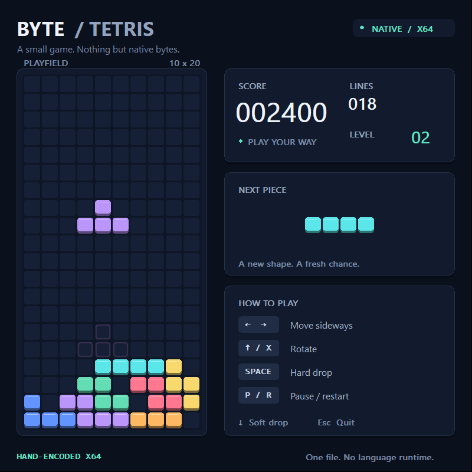

# astra制作的机器码俄罗斯方块

**13.5 KiB · Windows x64 · 手工编码机器指令 · 单文件图形游戏**

A hand-encoded Windows x64 falling-block game. The entire graphical game fits in a
13,824-byte native EXE, with no compiler toolchain or packaged language runtime.



## 这是什么？

这是一个直接编写 x64 操作码、手动构造 Windows PE32+ 可执行文件的实验项目。
窗口过程、碰撞、旋转、消行、计分和 GDI 绘图都由明确指定的机器指令字节实现。

**“手写”指操作码直接编码，不是声称逐字节手敲整个 EXE：** Python 标准库仅负责写入字节、
填充相对地址、组织数据，以及生成 PE 文件头、导入表和栈展开信息。
Python 不在成品中，也不参与游戏运行。本项目在 AI 辅助下完成指令编码与验证。

- 成品：**13,824 字节 / 13.5 KiB**
- `.text` 指令区：**7,226 字节**
- 不使用 C/C++ 编译器、外部汇编器、链接器、PyInstaller 或游戏引擎
- 不需要 `pip install`，没有第三方 Python 包依赖
- 不包含外部图片、音频或字体文件
- 仅调用 Windows 自带的 `KERNEL32.dll`、`USER32.dll`、`GDI32.dll`、`DWMAPI.dll`

## 下载并运行

在本仓库的 **[Releases](https://github.com/CJY019/byte-tetris/releases)** 下载 `TetrisMachine.exe`，双击即可运行。
只需这一个文件，不需要下载源码、安装 Python 或放置资源文件。

目标环境：Windows 10/11 x64；已在 Windows 11 x64 验证。不是跨平台可执行文件。
界面采用固定 800×800 客户区，建议桌面高度至少 900 像素；低分辨率环境可能裁切窗口。
这是未签名的实验程序；不确定来源时请先审阅源码并自行构建，不必关闭系统安全功能。

| 按键 | 操作 |
|---|---|
| ← / → | 左右移动 |
| ↑ / X | 顺时针旋转 |
| ↓ | 软降 |
| 空格 | 直接落底 |
| P | 暂停 / 继续 |
| R | 重新开始 |
| Esc / Q | 退出 |

切出窗口会自动暂停，返回后按 P 继续。包含彩色方块、落点预览、下一块预览、
消行计分和随进度加快的下落速度。这是简化的落块游戏，不是官方规则的完整实现。

## 从源码构建

需要 **Python 3.10+**；运行原生机器码测试则需要 **Windows x64 + 64 位 Python**。
不需要安装任何第三方包或本地编译器。

```powershell
python src/build_machine.py
```

会生成根目录的 `TetrisMachine.exe`，并更新 `docs/machine-code.hex` 与
`docs/machine-map.json`。构建是确定性的，当前版本 EXE 的 SHA-256 为：

```text
b9298c23d51c633ab9e2a72742fabf499f82d268dac4397c9d46f6df1e793f40
```

Windows PowerShell 可这样核对：

```powershell
Get-FileHash -LiteralPath .\TetrisMachine.exe -Algorithm SHA256
```

## 查看所有字节与手写机器码

**查看 EXE 的全部字节：**

```powershell
Format-Hex -LiteralPath .\TetrisMachine.exe
```

**定位某个函数的实际 EXE 字节：**

```powershell
.\tools\Inspect-MachineCode.ps1 -Function collides -Count 96
.\tools\Inspect-MachineCode.ps1 -Function paint_frame -Count 96
```

检查脚本只读文件，不执行游戏。如果本机不允许运行 PS1，直接使用 `Format-Hex` 即可，
不需要修改执行策略。

- [完整机器码清单](docs/machine-code.hex)：带函数标签的实际指令字节
- [详细查看教程](docs/MACHINE_CODE.md)：PE 文件偏移、RVA、指令示例与逐字节核对
- [游戏核心编码](src/machine_core.py)
- [图形界面与 PE 构造](src/build_machine.py)

## 验证

```powershell
python tests/test_machine.py
python tests/test_gui.py
```

测试也只使用标准库和 Windows API：

- **39 项机器码 / PE 检查**：映射实际 EXE 并调用其中的指令，不是另写 Python 游戏代替测试
- 包含 5,000 次随机碰撞对比、80 局随机操作与 1,207 次落底
- **19 项真实 GUI 检查**：启动、键盘、计时、暂停、消行、计分、退出
- 验证 200 次重绘不会持续增加 GDI 句柄
- 已验证 EXE 单独复制到空目录仍可运行

GUI 测试会在 `.artifacts/` 生成诊断截图和日志，这些文件已被 Git 忽略，不属于发布包。
README 的截图来自真实 EXE 的绘制缓冲区；使用固定测试棋盘便于检查布局，并非网页或图片生成模型模拟。

## 项目结构

```text
src/       手写 x64 操作码、地址修补和 PE 生成
tests/    Windows 原生机器码与 GUI 测试
tools/    PowerShell 只读字节检查工具
docs/     机器码清单、地址映射与查看教程
assets/   README 展示截图
```

本地生成的 EXE 不进入 Git 历史，通过 Releases 分发。公开仓库不包含测试日志、
临时窗口截图或完整文件的重复文本转储。

## License

[MIT](LICENSE)。这是独立的技术实验，与 The Tetris Company 无关联。
